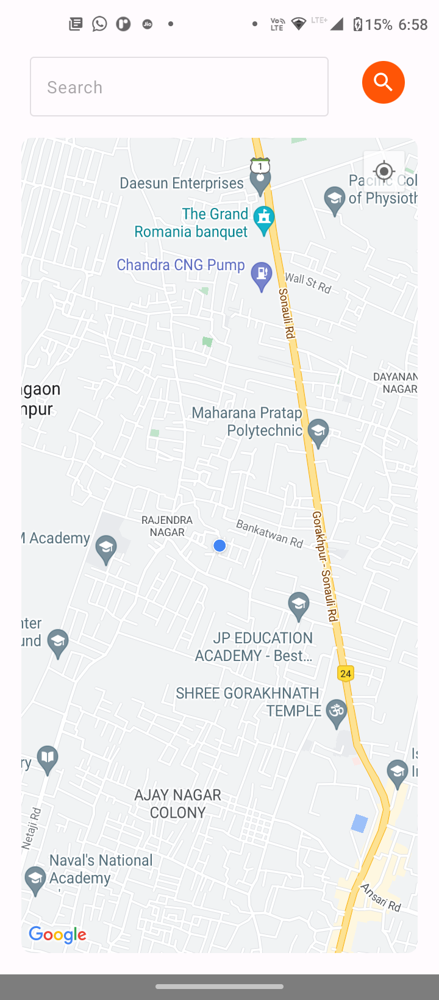

# Nearby POI
## Demo

Insert gif or link to demo
## Run Locally

Clone the project

```bash
  git clone https://github.com/Chandra-Mauli-Sharma/Nearby-POI
```

Go to the project directory

```bash
  cd Nearby-POI
```

Open Project in Android Studio or Intellij

or

In terminal use
```bash
  ./gradlew build
```
to build the Module
## Screenshots




## Highlights

Kotlin

Retrofit

Jetpack Compose

Coil(Image Loading Library)

MVVM architecture


